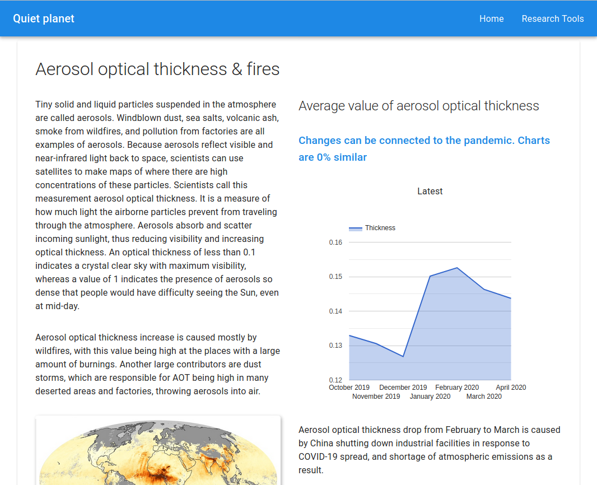
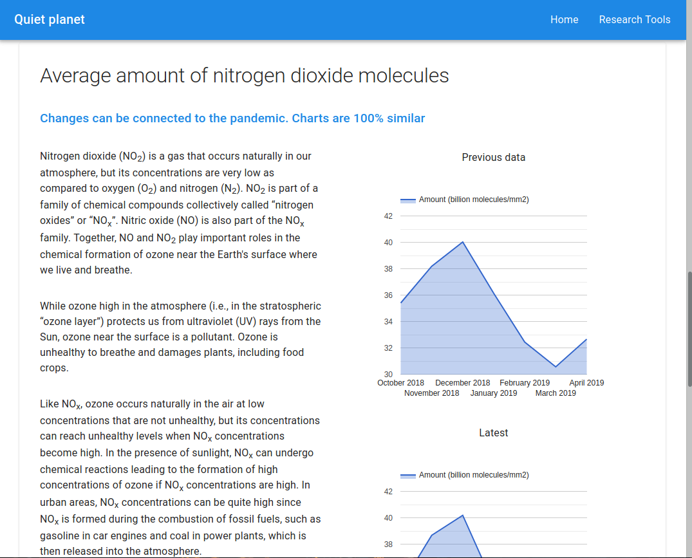
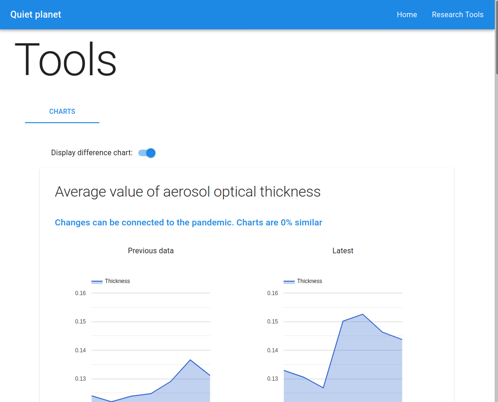
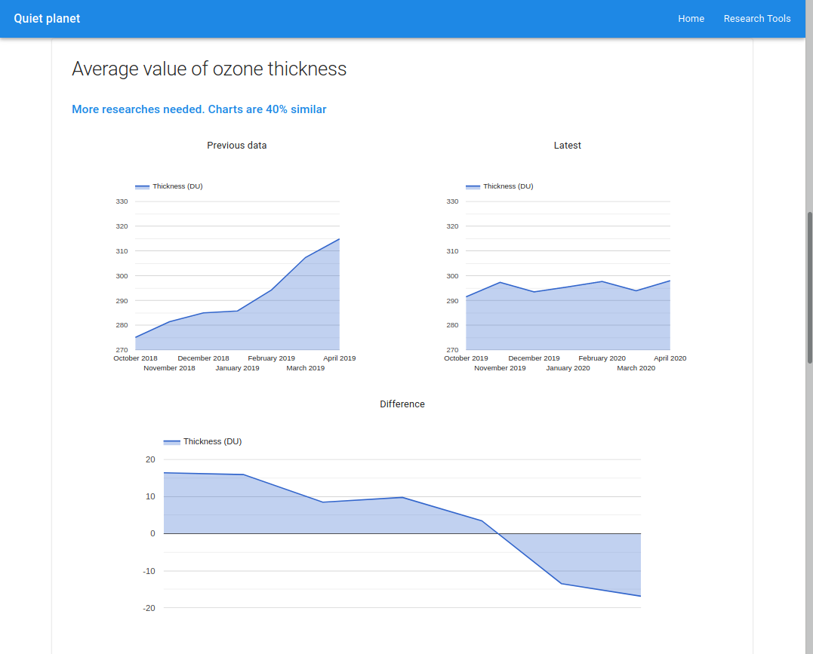

# Quiet Planet
**NASA Space Apps 2020 COVID-19 Challenge solution by Data Scouts**

<hr>

## Table of contents
- [Requirements](#requirements)
- [Dependencies](#dependencies)
- [Running app](#running-app)
- [Screenshots](#screenshots)

<hr>

## Requirements
- [Python 3](https://python.org)
- [Node.js](https://nodejs.org)

## Dependencies
- **Node.js**
    * next
    * react
    * react-dom
    * @material-ui/core
    * react-google-charts

## Running app
### Generating graphs
```bash
cd <project-root-directory>
python3 analyze/index.py
```

### Running server
```bash
cd <project-root-directory>
cd app
# development
npm run dev
# building for production
npm run build
# running built app
npm run start
```

## Screenshots




